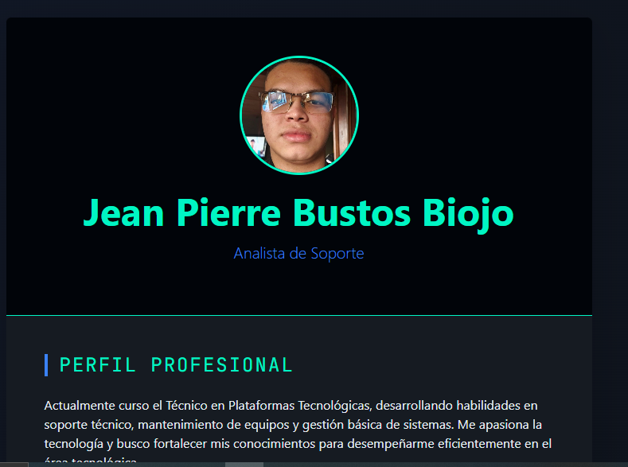
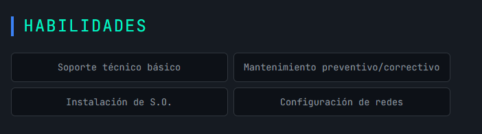
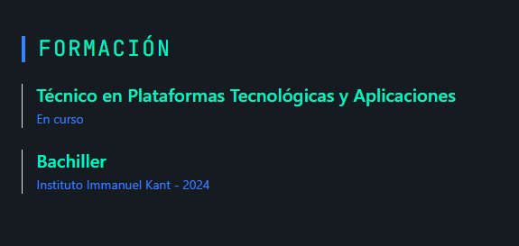

# Perfil Profesional Web - Jean Pierre Bustos

## Información General

- **Nombre del proyecto:** Perfil Profesional Web
- **Estudiante:** Jean Pierre Bustos Biojo
- **Fecha:** 28 de febrero de 2026
- **Curso:** Técnico en Plataformas Tecnológicas

---

## Descripción del Proyecto

### ¿Qué hace el proyecto?

Este proyecto es una página web tipo perfil profesional o tarjeta digital de presentación, donde se muestra información académica, habilidades y datos de contacto.

### ¿Qué problema soluciona?

Permite tener una presentación profesional digital accesible desde cualquier navegador, ideal para compartir en procesos académicos o laborales.

### ¿Para quién está pensado?

Está pensado para estudiantes o profesionales que deseen tener una presentación web moderna y organizada.

---

## Herramientas Utilizadas

- HTML5
- CSS
- Bootstrap 5
- Google Fonts (JetBrains Mono)
- Git
- GitHub

## Estructura del Proyecto

/perfil-profesional
- index.html
- style.css
- Imagen-de-Perfil.jpg

  
### Explicación:

- **index.html:**  
  Archivo principal del proyecto. Contiene toda la estructura semántica de la página utilizando HTML y Bootstrap para lograr un diseño centrado y responsivo.  
  Incluye la integración de:
  - Bootstrap para estilos y componentes.
  - Google Fonts (JetBrains Mono) para tipografía personalizada.
  - Secciones organizadas en tarjeta (card) con encabezado, cuerpo y pie de página.
  - Información estructurada en bloques como Perfil Profesional, Habilidades y Formación.

- **style.css:**  
  Archivo de estilos personalizados que complementa Bootstrap.  
  Implementa:
  - Variables CSS definidas en `:root` para mantener coherencia en la paleta de colores.
  - Diseño visual oscuro con gradientes de fondo.
  - Personalización de tarjetas (`tech-card`).
  - Estilos para títulos con efecto visual lateral.
  - Efecto hover en la imagen de perfil (zoom suave).
  - Diseño de badges personalizados para habilidades.

- **Imagen-de-Perfil.jpg:**  
  Imagen utilizada como fotografía dentro del encabezado de la tarjeta.  
  Se presenta en formato circular mediante `border-radius: 50%`, con borde personalizado y efecto interactivo al pasar el cursor.

---

## Funcionalidades

1.  Diseño profesional tipo tarjeta.
2.  Imagen de perfil con efecto hover (zoom).
3.  Sección de perfil profesional.
4.  Sección de habilidades organizada en formato visual.
5.  Sección de formación académica.
6.  Diseño responsivo usando Bootstrap.
8.  Uso de variables CSS para personalización de colores.

---

## Capturas de Pantalla

###  Vista Principal

### Sección de Habilidades

### Sección de Formación

##  Cómo ejecutar el proyecto

1. Descargar o clonar el repositorio.
2. Abrir la carpeta del proyecto.
3. Ejecutar el archivo `index.html` en el navegador.

---

## Mejoras Futuras

- Agregar animaciones con JavaScript.
- Integrar formulario de contacto funcional.
- Agregar modo claro/oscuro dinámico.

---

